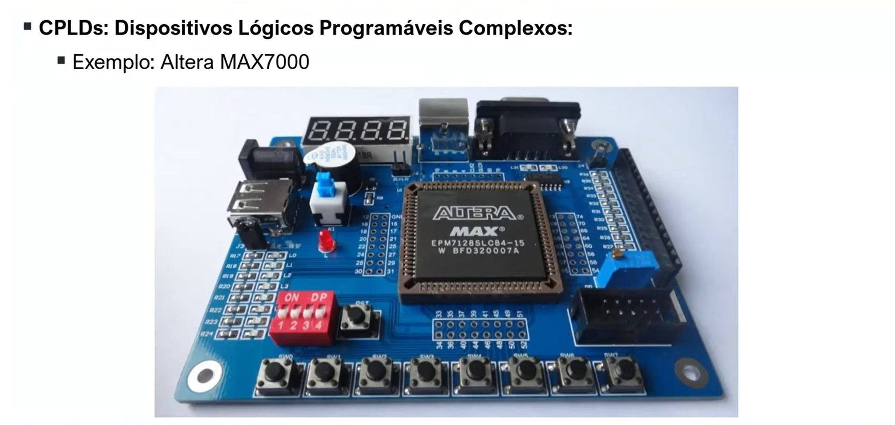
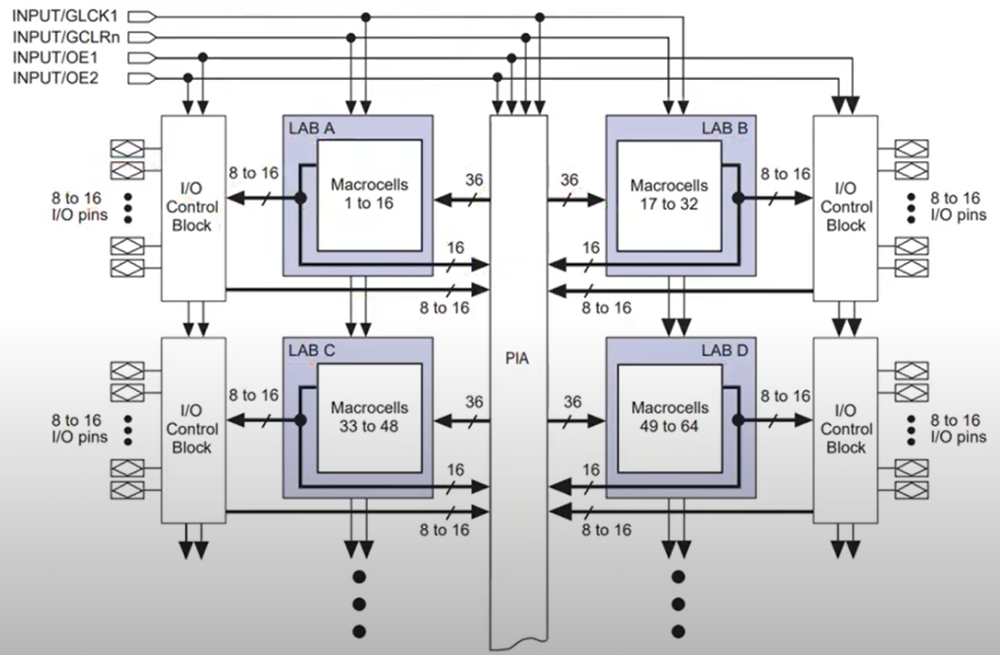

# 📚 FPGA e Verilog – Aula 07  
## Dispositivos Lógicos Programáveis Complexos (CPLD)  

**📅 Data:** 07/09/2025  
**📚 Tema:** CPLDs – Estrutura e Funcionamento  

---

### 📖 Resumo da Aula
Com a evolução da tecnologia, percebeu-se que os **SPLDs (Simple PLDs)** não supriam mais a demanda de circuitos digitais cada vez mais complexos.  
A solução foi **combinar vários SPLDs em um único chip**, surgindo assim os **CPLDs (Complex Programmable Logic Devices)**.  

  

Em média, um CPLD possui de **2 a 64 estruturas equivalentes a SPLDs**, interligadas por uma matriz de interconexão.  

---

### 🔎 Características dos CPLDs
- Maior capacidade de síntese de lógica: conseguem implementar **um número relativamente grande de portas lógicas em um único chip**.  
- Grande número de **pinos de entrada e saída**.  
- Adequados para projetos de **média a alta complexidade**.  
- **Sempre reprogramáveis**.  
- **Não voláteis** → mantêm a configuração mesmo sem energia.  

---

### 📌 Estrutura interna de um CPLD
Um CPLD é composto por três blocos principais:

  

1. **LAB (Logic Array Block)**  
   - Equivalente a um SPLD.  
   - Contém em média **8 a 18 macrocélulas (saídas)**.  
   - Cada LAB pode ter **4 a 16 termos produtos (AND)**.  
   - Em média, **36 entradas**.  

2. **PIA (Programmable Interconnect Array)**  
   - Rede de interconexão **reconfigurável** que liga os LABs.  
   - As entradas externas não se ligam diretamente a um LAB, mas sim ao **PIA** → e depois são distribuídas para os LABs conforme necessário.  

3. **I/O Blocks (Blocos de Entrada/Saída)**  
   - Controlam se um pino do CPLD vai atuar como **entrada** ou **saída**.  
   - Diferente de SPLDs: no CPLD **todos os pinos são configuráveis** (não há pinos dedicados).  
   - Implementam buffers de controle (Output Enable) para permitir pinos bidirecionais.  

---

### 📚 Definições importantes
- **Volátil:** perde a configuração quando o dispositivo é desligado.  
  - Exemplo: FPGAs baseadas em SRAM.  
- **Não volátil:** mantém a configuração mesmo sem energia.  
  - Exemplo: CPLDs (configuração salva em EEPROM).  

---

### 💾 EEPROM
- **EEPROM (Electrically Erasable Programmable Read-Only Memory):**  
  - Memória que pode ser programada e apagada eletricamente.  
  - Permite que o CPLD seja **reprogramado várias vezes**.  
  - Armazena permanentemente as informações de configuração (sem perder ao desligar).  

---

### ✅ Conclusão
- O **CPLD** é a evolução natural do SPLD, oferecendo maior capacidade de lógica, maior número de pinos e flexibilidade de interconexão.  
- Ele mantém a simplicidade conceitual dos SPLDs, mas em **escala maior**.  
- É ideal para projetos de **média complexidade**, antes de se partir para **FPGAs**.  

---
