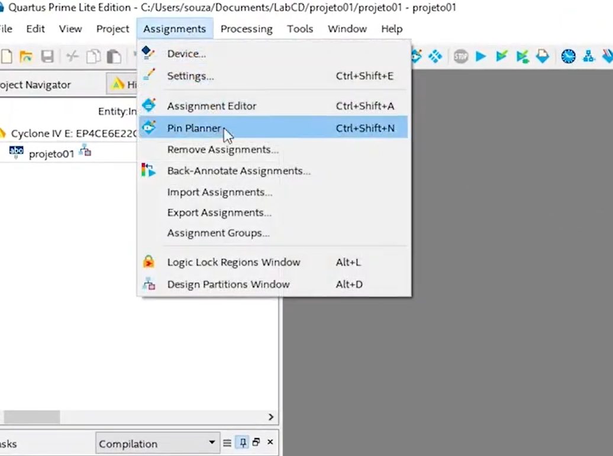
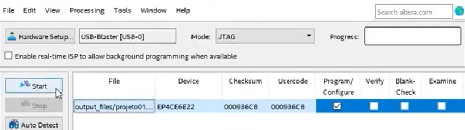
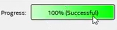

# FPGA e Verilog - Aula 13 - Programando a FPGA (Altera Cyclone IV)**

> **Objetivo:** configurar pinos no Quartus, compilar o projeto e programar a FPGA via **USB‑Blaster** usando **JTAG**. Exemplo prático com o **Projeto 01 (Somador Completo)**: entradas em chaves, saídas em LEDs.

---

## 1) Por que **USB‑Blaster**? O que é **JTAG**?

- **USB‑Blaster** é a interface da Intel/Altera que converte **USB ↔ JTAG**.  
  - **JTAG** (Joint Test Action Group) é um protocolo padrão para **programação** e **teste** em chips. Na placa, o USB‑Blaster envia/recebe os sinais **TCK, TMS, TDI, TDO** até a FPGA.
- Com ele você pode:
  - **Carregar** um arquivo **`.sof`** diretamente na **SRAM** da FPGA (volátil — perde ao desligar).
  - (Opcional) **Gravar** memória de configuração externa (ex.: EPCS/AS) usando **`.pof`** no modo **Active Serial** — persiste após desligar.
- **Resumo da conexão**: **PC (USB)** ⇄ **USB‑Blaster** ⇄ **JTAG 10 pinos** da **placa FPGA**.

> ⚠️ **Importante:** além do cabo JTAG, **alimente a placa** (USB de alimentação ou fonte DC, conforme o hardware). Sem alimentação, a programação falha.

---

## 2) Montagem física e “primeiro boot”

1. **Alimentar** a placa (ver chave liga/desliga).  
2. **Conectar** o cabo **USB‑Blaster** ao conector **JTAG** (atenção ao pino 1).  
3. Alguns kits acendem **displays/LEDs** ao ligar — comportamento **depende** da lógica do kit (muitos LEDs são **ativo‑baixo**).

---

## 3) Preparando o **Projeto 01 (Somador Completo)** na placa

### 3.1 Mapeamento desejado (exemplo da aula)

- **Entradas (chaves):**
  - **Chave 1** → `a`
  - **Chave 2** → `b`
  - **Chave 3** → `cin`
- **Saídas (LEDs):**
  - **LED D6**  → `cout`
  - **LED D12** → `s`

> 🔎 **Atenção:** a serigrafia **D6**, **D12**, “Chave 1”, etc., **varia por placa**. Consulte a **documentação do seu kit** para descobrir **quais pinos físicos** do FPGA correspondem a cada recurso.

### 3.2 Onde descobrir os pinos?
- Procure a planilha/arquivo de pinos do kit (ex.: `.xls`):  
  
- Ela relaciona **recurso da placa** ↔ **pino físico da FPGA** (ex.: `PIN_AB12`).  
- Em algumas placas, os sinais já vêm **impressos na PCB** ao lado dos conectores/LEDs.

### 3.3 Atribuições no **Pin Planner**
1. **Quartus** → `Assignments > Pin Planner`  
   
2. Na aba de pinos, localize as portas do seu **top‑level** (`a`, `b`, `cin`, `s`, `cout`) e **atribua**:
   - **Location**: o **pino físico** (ex.: `PIN_<...>`) segundo a planilha.
   - **I/O Standard**: normalmente **`3.3‑V LVTTL`** para chaves/LEDs on‑board (confirme no manual!).
   - (Opcional) **Weak Pull‑Up** nas **entradas** (se necessário).
   
3. **Salvar**. As atribuições ficam no arquivo do projeto **`.qsf`**.

> 💡 **Dica prática:** se os **LEDs são ativo‑baixo**, você verá lógica **invertida** (LED acende com `0`). Ajuste no **hardware** (resistor/transistor já fixos) ou inverta no **Verilog** (`assign led = ~s;`).

### 3.4 Recompilar
- `Processing > Start Compilation` (ou botão **▶ Compile**). Aguarde terminar sem erros.

---

## 4) Programando a FPGA (JTAG)

1. **Abrir o Programmer**: `Tools > Programmer`  
   
2. **Hardware Setup...** → selecione **USB‑Blaster**.  
   - Se **não aparecer**: driver do USB‑Blaster não instalado/cabo desconectado.  
   
3. **Mode**: **JTAG**.  
4. **Add File...** → selecione o **`.sof`** recém‑compilado.  
5. Marque **Program/Configure** e clique **Start**.  
   
6. Aguarde **100%**. Deve aparecer **“Successful”**.  
   

> ✅ Agora teste: altere as **chaves** (`a`, `b`, `cin`) e observe os **LEDs** (`s`, `cout`). Se a lógica parecer invertida, verifique **ativo‑baixo** e pinos/IO‑standard.

---

## 5) (Opcional) Gravação não volátil

- Para que o projeto **permaneça** após desligar:
  1. `File > Convert Programming Files...` → gerar **`.pof`** (modo **Active Serial**/EPCS).  
  2. `Tools > Programmer` → **Mode: Active Serial** → programar a **memória de configuração** do kit.
- Nem todos os kits têm memória AS — confirme na documentação.

---

## 6) Resumo de **boas práticas** e **pitfalls**

- **Alimentação** primeiro; verifique **chave ON** na placa.  
- **USB‑Blaster** correto no **Hardware Setup**; cabo firme no conector **JTAG** (pino 1).  
- **IO Standard** compatível (**3.3‑V LVTTL** é o mais comum).  
- **Recompile** após qualquer alteração de pinos (`.qsf`).  
- **Entradas flutuando?** Ative **pull‑up** interno ou use resistores externos conforme o esquema do kit.  
- **LED não acende**: checar se é **ativo‑baixo** e se o pino mapeado está correto.  
- **Erro JTAG**: conferir driver, cabo, alimentação, seleção de dispositivo na cadeia (**Auto Detect** pode ajudar).

---

## 7) Apêndice — Exemplo de entradas/saídas e mapeamento (placeholders)

> Preencha os pinos reais a partir da planilha do seu kit.

| Sinal (top-level) | Recurso na placa | Pino FPGA (ex.) | IO Standard        | Observação                  |
|---|---|---|---|---|
| `a`   | Chave 1      | `PIN_<SW1>`   | 3.3‑V LVTTL      | Pode precisar pull‑up |
| `b`   | Chave 2      | `PIN_<SW2>`   | 3.3‑V LVTTL      |                       |
| `cin` | Chave 3      | `PIN_<SW3>`   | 3.3‑V LVTTL      |                       |
| `s`   | LED D12      | `PIN_<LED12>` | 3.3‑V LVTTL      | LED possivelmente ativo‑baixo |
| `cout`| LED D6       | `PIN_<LED6>`  | 3.3‑V LVTTL      | LED possivelmente ativo‑baixo |

## 8) Referências rápidas

- **Pin Planner**: `Assignments > Pin Planner`  
- **Compilação**: `Processing > Start Compilation`  
- **Programmer (JTAG)**: `Tools > Programmer` → **USB‑Blaster** → **Add File (.sof)** → **Start**

---

> **Nota final:** Consulte sempre o **esquema elétrico** da placa para entender **níveis lógicos**, **pull‑ups/pull‑downs** e **inversões** (LEDs, botões, chaves). Isso explica por que alguns sinais “ligam” quando você escreve `0` (ativo‑baixo) e evita diagnósticos errados.
