# Projeto 01 — O primeiro circuito em Verilog (Somador Completo)

---

## 1) Objetivo

Descrever **estruturalmente** (com portas lógicas) o **somador completo** (*full adder*) em Verilog, **compilar no Quartus** e **simular no ModelSim** (sem testbench, forçando ondas nas entradas).

**Entradas:** `a`, `b`, `cin`  
**Saídas:** `s`, `cout`

**Equações de referência (para conferência):**
- `s    = a ^ b ^ cin`
- `cout = (a & b) | (cin & (a ^ b))`

**Diagrama lógico (referência):**
- 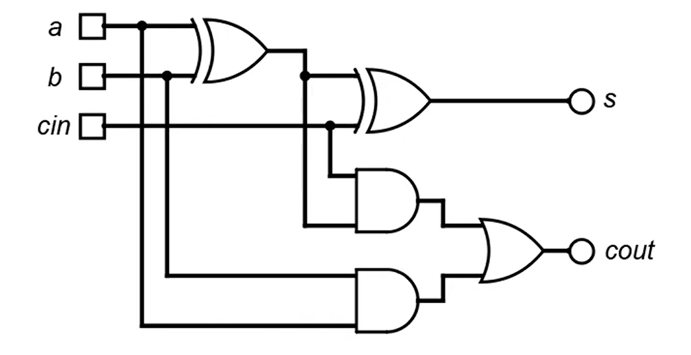

Dica útil na descrição **estrutural**: **nomeie as saídas intermediárias** das portas lógicas (ex.: `w1`, `w2`, `w3`) para facilitar a ligação entre blocos.  
Exemplo ilustrativo:  
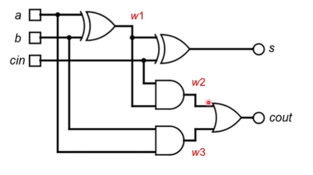

---

## 2) Criando o projeto no Quartus

1. Abra o Quartus → **File > New Project Wizard**.  
2. **Introduction** → clique em **Next**.  
3. **Directory, Name, Top-Level Entity**  
   - **Directory**: crie **uma pasta por projeto** (boa prática).  
   - **Name**: `projeto01`  
   - **Top-level entity**: `projeto01`  
   - 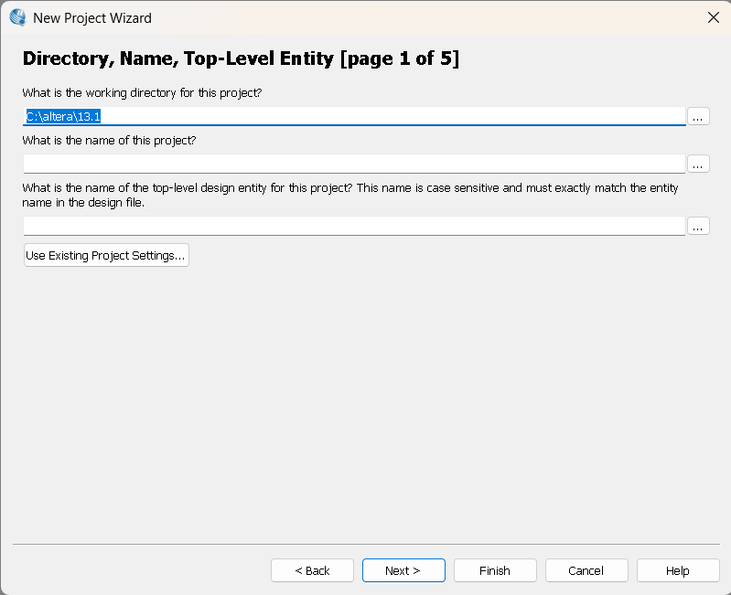
4. **Project Type**  
   - Marque **Empty project** (projeto em branco).  
5. **Add Files**  
   - *Pule por enquanto* (vamos criar o `.v` em seguida).  
6. **Family & Device Settings**  
   - Em **Device**, selecione o FPGA alvo. Se for **apenas simulação**, qualquer dispositivo suportado serve. (Na placa real, o **código do chip** está gravado no encapsulamento; utilize-o como referência.)  
   - 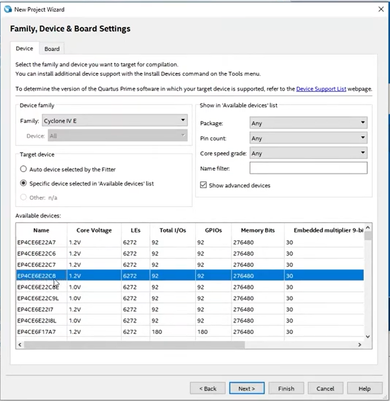
7. **EDA Tool Settings**  
   - Deixe como está (ModelSim/Intel FPGA Edition). Clique em **Next**.  
8. **Summary**  
   - Revise **nome do projeto**, **dispositivo** e **diretório**. Clique em **Finish**.

> **O que é “Top-level entity”?**  
> É o **módulo Verilog de mais alto nível** que a síntese e a simulação usarão como “porta de entrada” do projeto. Manter **arquivo .v**, **módulo** e **Top-level** com o mesmo nome ajuda a evitar confusões.

---

## 3) Criando o arquivo Verilog

1. **File > New** → **Verilog HDL File**.  
   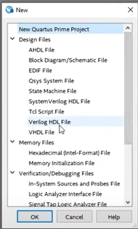
2. Cole o código abaixo e **salve como** `projeto01.v`:

```verilog
// ---------------------------------------------------------
// projeto01.v
// Descrição: Somador completo (full adder) - abordagem estrutural
// Entradas:  a, b, cin
// Saídas:    s, cout
// ---------------------------------------------------------
module projeto01 (
   input a, b, cin;
   output s, cout;
);

    // Fios intermediários (1 bit)
    wire w1, w2, w3;

    // Abordagem estrutural com primitivas do Verilog
    xor u0 (w1,   a,   b);
    xor u1 (s,    w1,  cin);
    and u2 (w2,   cin, w1);
    and u3 (w3,   a,   b);
    or  u4 (cout, w2,  w3);

endmodule
```

3. **Salve** (ícone do disquete).  
4. **Compile** (ícone do **play** azul). Ao terminar, verifique as mensagens do compilador.

---

## 4) Conferindo o esquemático (RTL)

- **Tools > Netlist Viewers > RTL Viewer**  
  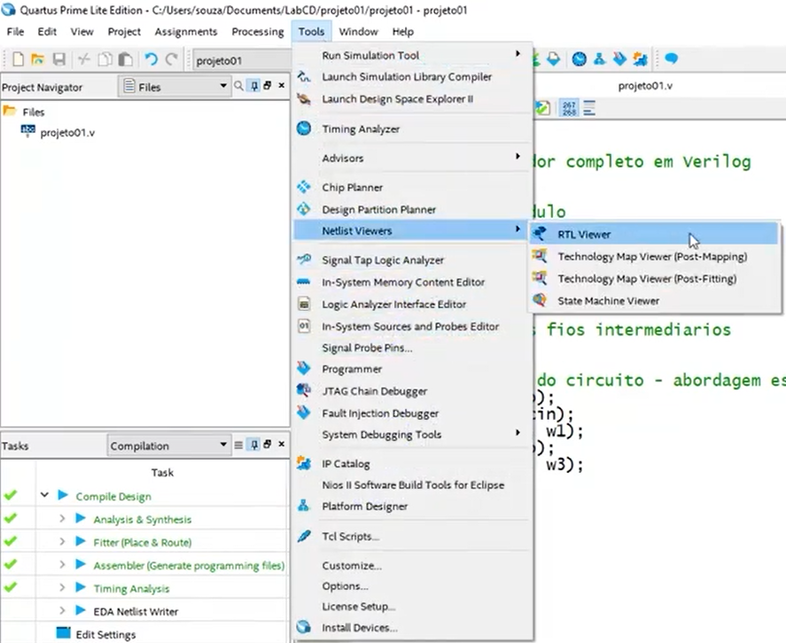  
- Confirme se o RTL corresponde ao somador completo (duas XOR, duas AND, uma OR).

---

## 5) Simulando no ModelSim (sem testbench)

> Evitaremos o simulador interno do Quartus; usaremos **ModelSim** (ou Questa) e **forçaremos** ondas nas entradas.

1. No Quartus: **Tools > Run Simulation Tool > RTL Simulation**.  
   - Escolha **Verilog** quando solicitado.  
   - 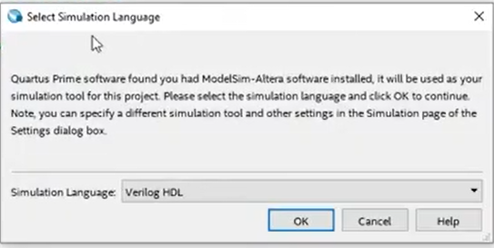
2. No **ModelSim**:
   - Em **Library**, expanda **work** → localize `projeto01` → **botão direito > Simulate**.  
     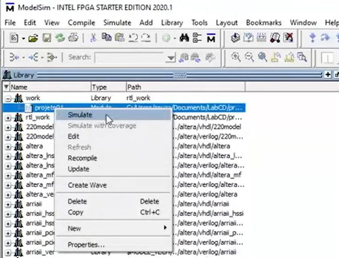
   - Na janela **Objects**, arraste `a`, `b`, `cin`, `s`, `cout` para a **Wave**.
3. **Forçando entradas como clock** (gera todas as combinações de 3 bits):
   - **cin**: botão direito → **Modify > Apply Wave...** → **Clock**  
     - *Initial value:* `0`
     - *Clock period:* `100 ps`  
     - *Duty cycle:* `50%`  
     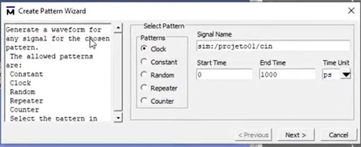
   - **b**: repita com **período = 200 ps** (2×)  
   - **a**: repita com **período = 400 ps** (4×)  
   - Organize na Wave do mais significativo para o menos: `a  b  cin  |  s  cout`.  
     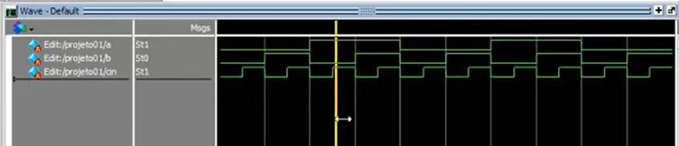
4. **Tempo de simulação**
   - Ajuste **Run** para **1000 ps** (1 ns).  
     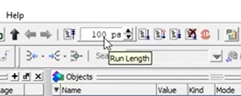  
   - Clique **Run**.  
     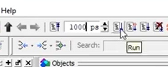
5. **Conferência**  
   - Percorra a Wave e confira se `s` e `cout` obedecem à tabela-verdade do somador completo.

---

## 6) Observações e correções técnicas que apliquei

- **Grafia e termos**: “Quartus”, “New Project Wizard”, “sumário”, “simulação comportamental (RTL)”.  
- **Código Verilog**:  
  - Uso de `input wire`/`output wire` (sintaxe moderna e clara).  
  - Declaração correta de `wire w1, w2, w3;` com comentários após `;`.  
  - Instâncias das primitivas `xor`, `and`, `or` com ordem consistente de portas.  
- **Top-level entity**: manter o nome do **módulo** igual ao **Top-level** simplifica a configuração.  
- **ModelSim**: processo de **Apply Wave (Clock)** para gerar combinações binárias sem testbench.

---

## 7) Checklist rápido

- [ ] `projeto01.v` salvo e adicionado ao projeto.  
- [ ] Compilação sem erros.  
- [ ] **RTL Viewer** condizente com o diagrama (XOR/AND/OR).  
- [ ] Simulação com períodos `a=400 ps`, `b=200 ps`, `cin=100 ps`.  
- [ ] Formas de onda de `s` e `cout` compatíveis com a lógica esperada.
