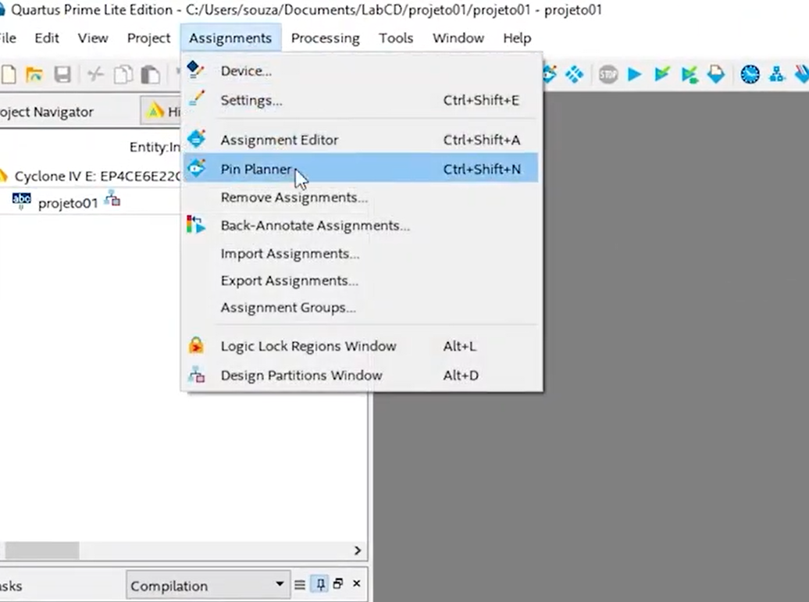
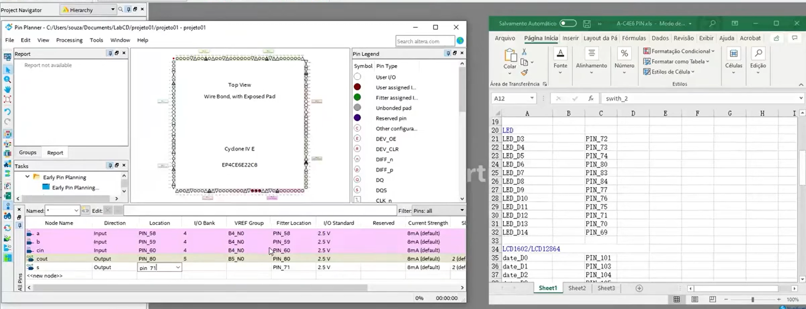
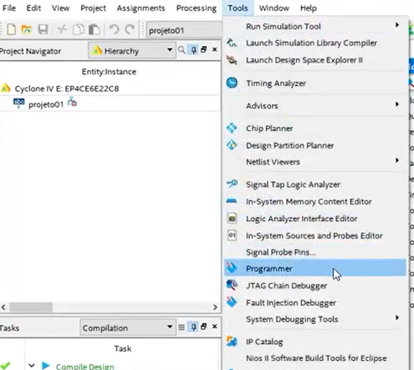
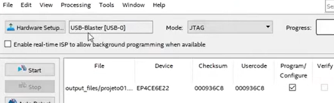
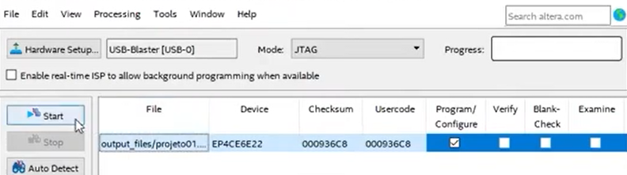
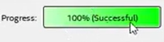

# Projeto 01 — O primeiro circuito em Verilog (Somador Completo)

---

## 1) Objetivo

Descrever **estruturalmente** (com portas lógicas) o **somador completo** (*full adder*) em Verilog, **compilar no Quartus** e **simular no ModelSim** (sem testbench, forçando ondas nas entradas).

**Entradas:** `a`, `b`, `cin`  
**Saídas:** `s`, `cout`

**Equações de referência (para conferência):**
- `s    = a ^ b ^ cin`
- `cout = (a & b) | (cin & (a ^ b))`

**Diagrama lógico (referência):**
- 

Dica útil na descrição **estrutural**: **nomeie as saídas intermediárias** das portas lógicas (ex.: `w1`, `w2`, `w3`) para facilitar a ligação entre blocos.  
Exemplo ilustrativo:  


---

## 2) Criando o projeto no Quartus

1. Abra o Quartus → **File > New Project Wizard**.  
2. **Introduction** → clique em **Next**.  
3. **Directory, Name, Top-Level Entity**  
   - **Directory**: crie **uma pasta por projeto** (boa prática).  
   - **Name**: `projeto01`  
   - **Top-level entity**: `projeto01`  
   - 
4. **Project Type**  
   - Marque **Empty project** (projeto em branco).  
5. **Add Files**  
   - *Pule por enquanto* (vamos criar o `.v` em seguida).  
6. **Family & Device Settings**  
   - Em **Device**, selecione o FPGA alvo. Se for **apenas simulação**, qualquer dispositivo suportado serve. (Na placa real, o **código do chip** está gravado no encapsulamento; utilize-o como referência.)  
   - 
7. **EDA Tool Settings**  
   - Deixe como está (ModelSim/Intel FPGA Edition). Clique em **Next**.  
8. **Summary**  
   - Revise **nome do projeto**, **dispositivo** e **diretório**. Clique em **Finish**.

> **O que é “Top-level entity”?**  
> É o **módulo Verilog de mais alto nível** que a síntese e a simulação usarão como “porta de entrada” do projeto. Manter **arquivo .v**, **módulo** e **Top-level** com o mesmo nome ajuda a evitar confusões.

---

## 3) Criando o arquivo Verilog

1. **File > New** → **Verilog HDL File**.  
   
2. Cole o código abaixo e **salve como** `projeto01.v`:

```verilog
// ---------------------------------------------------------
// projeto01.v
// Descrição: Somador completo (full adder) - abordagem estrutural
// Entradas:  a, b, cin
// Saídas:    s, cout
// ---------------------------------------------------------
module projeto01 (a, b, cin, s, cout);
   input a, b, cin;
   output s, cout;


    // Fios intermediários (1 bit)
    wire w1, w2, w3;

    // Abordagem estrutural com primitivas do Verilog
    xor u0 (w1,   a,   b);
    xor u1 (s,    w1,  cin);
    and u2 (w2,   cin, w1);
    and u3 (w3,   a,   b);
    or  u4 (cout, w2,  w3);

endmodule
```

3. **Salve** (ícone do disquete).  
4. **Compile** (ícone do **play** azul). Ao terminar, verifique as mensagens do compilador.

---

## 4) Conferindo o esquemático (RTL)

- **Tools > Netlist Viewers > RTL Viewer**  
    
- Confirme se o RTL corresponde ao somador completo (duas XOR, duas AND, uma OR).

---

## 5) Simulando no ModelSim (sem testbench)

> Evitaremos o simulador interno do Quartus; usaremos **ModelSim** (ou Questa) e **forçaremos** ondas nas entradas.

1. No Quartus: **Tools > Run Simulation Tool > RTL Simulation**.  
   - Escolha **Verilog** quando solicitado.  
   - 
2. No **ModelSim**:
   - Em **Library**, expanda **work** → localize `projeto01` → **botão direito > Simulate**.  
     
   - Na janela **Objects**, arraste `a`, `b`, `cin`, `s`, `cout` para a **Wave**.
3. **Forçando entradas como clock** (gera todas as combinações de 3 bits):
   - **cin**: botão direito → **Modify > Apply Wave...** → **Clock**  
     - *Initial value:* `0`
     - *Clock period:* `100 ps`  
     - *Duty cycle:* `50%`  
     
   - **b**: repita com **período = 200 ps** (2×)  
   - **a**: repita com **período = 400 ps** (4×)  
   - Organize na Wave do mais significativo para o menos: `a  b  cin  |  s  cout`.  
     
4. **Tempo de simulação**
   - Ajuste **Run** para **1000 ps** (1 ns).  
       
   - Clique **Run**.  
     
5. **Conferência**  
   - Percorra a Wave e confira se `s` e `cout` obedecem à tabela-verdade do somador completo.

---

## 6) Observações e correções técnicas que apliquei

- **Grafia e termos**: “Quartus”, “New Project Wizard”, “sumário”, “simulação comportamental (RTL)”.  
- **Código Verilog**:  
  - Uso de `input wire`/`output wire` (sintaxe moderna e clara).  
  - Declaração correta de `wire w1, w2, w3;` com comentários após `;`.  
  - Instâncias das primitivas `xor`, `and`, `or` com ordem consistente de portas.  
- **Top-level entity**: manter o nome do **módulo** igual ao **Top-level** simplifica a configuração.  
- **ModelSim**: processo de **Apply Wave (Clock)** para gerar combinações binárias sem testbench.

---

## 7) Checklist rápido

- [ ] `projeto01.v` salvo e adicionado ao projeto.  
- [ ] Compilação sem erros.  
- [ ] **RTL Viewer** condizente com o diagrama (XOR/AND/OR).  
- [ ] Simulação com períodos `a=400 ps`, `b=200 ps`, `cin=100 ps`.  
- [ ] Formas de onda de `s` e `cout` compatíveis com a lógica esperada.

# FPGA e Verilog - Aula 13 - Programando a FPGA (Altera Cyclone IV)**

> **Objetivo:** configurar pinos no Quartus, compilar o projeto e programar a FPGA via **USB‑Blaster** usando **JTAG**. Exemplo prático com o **Projeto 01 (Somador Completo)**: entradas em chaves, saídas em LEDs.

---

## 1) Por que **USB‑Blaster**? O que é **JTAG**?

- **USB‑Blaster** é a interface da Intel/Altera que converte **USB ↔ JTAG**.  
  - **JTAG** (Joint Test Action Group) é um protocolo padrão para **programação** e **teste** em chips. Na placa, o USB‑Blaster envia/recebe os sinais **TCK, TMS, TDI, TDO** até a FPGA.
- Com ele você pode:
  - **Carregar** um arquivo **`.sof`** diretamente na **SRAM** da FPGA (volátil — perde ao desligar).
  - (Opcional) **Gravar** memória de configuração externa (ex.: EPCS/AS) usando **`.pof`** no modo **Active Serial** — persiste após desligar.
- **Resumo da conexão**: **PC (USB)** ⇄ **USB‑Blaster** ⇄ **JTAG 10 pinos** da **placa FPGA**.

> ⚠️ **Importante:** além do cabo JTAG, **alimente a placa** (USB de alimentação ou fonte DC, conforme o hardware). Sem alimentação, a programação falha.

---

## 2) Montagem física e “primeiro boot”

1. **Alimentar** a placa (ver chave liga/desliga).  
2. **Conectar** o cabo **USB‑Blaster** ao conector **JTAG** (atenção ao pino 1).  
3. Alguns kits acendem **displays/LEDs** ao ligar — comportamento **depende** da lógica do kit (muitos LEDs são **ativo‑baixo**).

---

## 3) Preparando o **Projeto 01 (Somador Completo)** na placa

### 3.1 Mapeamento desejado (exemplo da aula)

- **Entradas (chaves):**
  - **Chave 1** → `a`
  - **Chave 2** → `b`
  - **Chave 3** → `cin`
- **Saídas (LEDs):**
  - **LED D6**  → `cout`
  - **LED D12** → `s`

> 🔎 **Atenção:** a serigrafia **D6**, **D12**, “Chave 1”, etc., **varia por placa**. Consulte a **documentação do seu kit** para descobrir **quais pinos físicos** do FPGA correspondem a cada recurso.

### 3.2 Onde descobrir os pinos?
- Procure a planilha/arquivo de pinos do kit (ex.: `.xls`):  
  
- Ela relaciona **recurso da placa** ↔ **pino físico da FPGA** (ex.: `PIN_AB12`).  
- Em algumas placas, os sinais já vêm **impressos na PCB** ao lado dos conectores/LEDs.

### 3.3 Atribuições no **Pin Planner**
1. **Quartus** → `Assignments > Pin Planner`  
   
2. Na aba de pinos, localize as portas do seu **top‑level** (`a`, `b`, `cin`, `s`, `cout`) e **atribua**:
   - **Location**: o **pino físico** (ex.: `PIN_<...>`) segundo a planilha.
   - **I/O Standard**: normalmente **`3.3‑V LVTTL`** para chaves/LEDs on‑board (confirme no manual!).
   - (Opcional) **Weak Pull‑Up** nas **entradas** (se necessário).
   
3. **Salvar**. As atribuições ficam no arquivo do projeto **`.qsf`**.

> 💡 **Dica prática:** se os **LEDs são ativo‑baixo**, você verá lógica **invertida** (LED acende com `0`). Ajuste no **hardware** (resistor/transistor já fixos) ou inverta no **Verilog** (`assign led = ~s;`).

### 3.4 Recompilar
- `Processing > Start Compilation` (ou botão **▶ Compile**). Aguarde terminar sem erros.

---

## 4) Programando a FPGA (JTAG)

1. **Abrir o Programmer**: `Tools > Programmer`  
   
2. **Hardware Setup...** → selecione **USB‑Blaster**.  
   - Se **não aparecer**: driver do USB‑Blaster não instalado/cabo desconectado.  
   
3. **Mode**: **JTAG**.  
4. **Add File...** → selecione o **`.sof`** recém‑compilado.  
5. Marque **Program/Configure** e clique **Start**.  
   
6. Aguarde **100%**. Deve aparecer **“Successful”**.  
   

> ✅ Agora teste: altere as **chaves** (`a`, `b`, `cin`) e observe os **LEDs** (`s`, `cout`). Se a lógica parecer invertida, verifique **ativo‑baixo** e pinos/IO‑standard.

---

## 5) (Opcional) Gravação não volátil

- Para que o projeto **permaneça** após desligar:
  1. `File > Convert Programming Files...` → gerar **`.pof`** (modo **Active Serial**/EPCS).  
  2. `Tools > Programmer` → **Mode: Active Serial** → programar a **memória de configuração** do kit.
- Nem todos os kits têm memória AS — confirme na documentação.

---

## 6) Resumo de **boas práticas** e **pitfalls**

- **Alimentação** primeiro; verifique **chave ON** na placa.  
- **USB‑Blaster** correto no **Hardware Setup**; cabo firme no conector **JTAG** (pino 1).  
- **IO Standard** compatível (**3.3‑V LVTTL** é o mais comum).  
- **Recompile** após qualquer alteração de pinos (`.qsf`).  
- **Entradas flutuando?** Ative **pull‑up** interno ou use resistores externos conforme o esquema do kit.  
- **LED não acende**: checar se é **ativo‑baixo** e se o pino mapeado está correto.  
- **Erro JTAG**: conferir driver, cabo, alimentação, seleção de dispositivo na cadeia (**Auto Detect** pode ajudar).

---

## 7) Apêndice — Exemplo de entradas/saídas e mapeamento (placeholders)

> Preencha os pinos reais a partir da planilha do seu kit.

| Sinal (top-level) | Recurso na placa | Pino FPGA (ex.) | IO Standard        | Observação                  |
|---|---|---|---|---|
| `a`   | Chave 1      | `PIN_<SW1>`   | 3.3‑V LVTTL      | Pode precisar pull‑up |
| `b`   | Chave 2      | `PIN_<SW2>`   | 3.3‑V LVTTL      |                       |
| `cin` | Chave 3      | `PIN_<SW3>`   | 3.3‑V LVTTL      |                       |
| `s`   | LED D12      | `PIN_<LED12>` | 3.3‑V LVTTL      | LED possivelmente ativo‑baixo |
| `cout`| LED D6       | `PIN_<LED6>`  | 3.3‑V LVTTL      | LED possivelmente ativo‑baixo |


## 8) Referências rápidas

- **Pin Planner**: `Assignments > Pin Planner`  
- **Compilação**: `Processing > Start Compilation`  
- **Programmer (JTAG)**: `Tools > Programmer` → **USB‑Blaster** → **Add File (.sof)** → **Start**

---

> **Nota final:** Consulte sempre o **esquema elétrico** da placa para entender **níveis lógicos**, **pull‑ups/pull‑downs** e **inversões** (LEDs, botões, chaves). Isso explica por que alguns sinais “ligam” quando você escreve `0` (ativo‑baixo) e evita diagnósticos errados.

